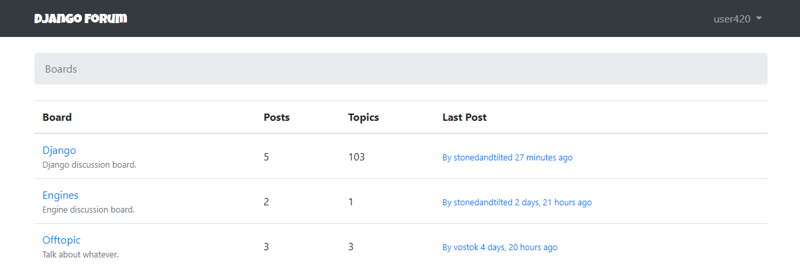
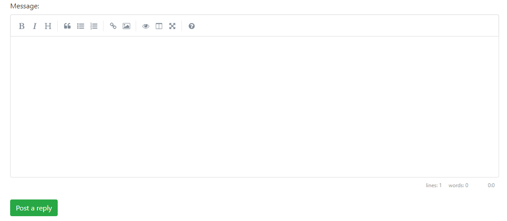

# Django Forum

Web application that uses Django to implement a forum template.

## Aspects covered: 

- Data models 
- Structured views
- Extensibility 
- User authentication system and account manage
- Multiple structured tests
- Added markdown for messages
- Markdown editor using SimpleMDE

- Humanize package used to improve the comprehension of the data
- Using Gravatar to manage profile pictures
